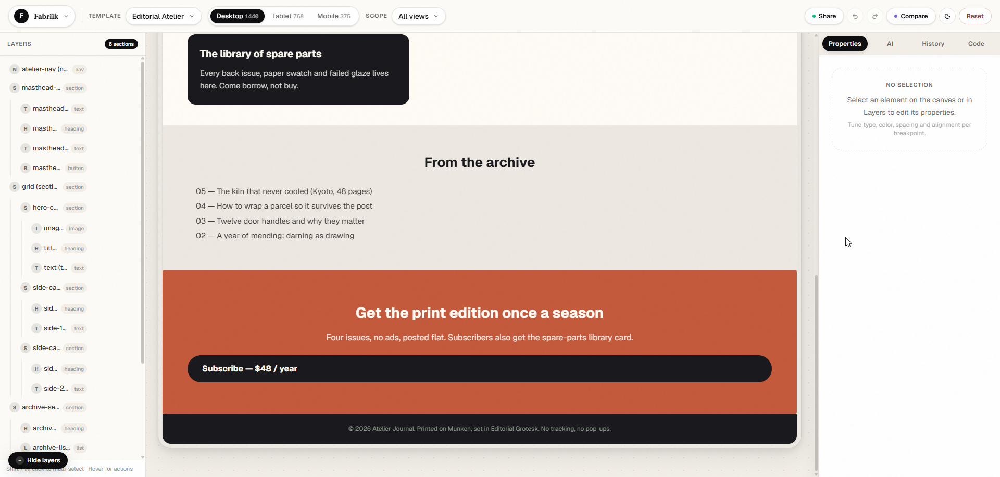
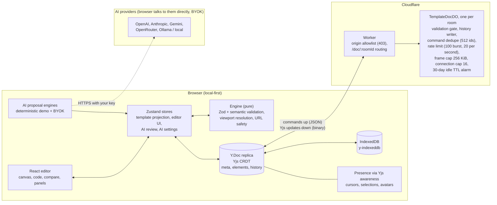

<h1 align="center">Fabriik - Multiplayer Canvas Editor</h1>


**A quick, fun single-page website editor.** Build on the canvas or in code, preview every viewport, and open a live room to mess around with friends.

[](https://github.com/AishSoni/Fabriik-MP-Creator/actions/workflows/ci.yml)
[](https://aish-s-fabriik-mp.vercel.app)
[](#license)

<!-- Add a screenshot or short GIF here as soon as one is available. A visual near the top is the highest-impact addition to this README. Example:

-->

> **Try it live:** https://aish-s-fabriik-mp.vercel.app. No account required. Pick a starter page, remix it, then click **Share** to pull a friend into the same room.

**Contents:** [Features](#features) · [Architecture](#architecture) · [Non-goals](#non-goals) · [Quick start](#quick-start) · [Usage](#usage) · [Security model](#security-model--trade-offs) · [Configuration](#configuration) · [Scripts](#scripts) · [Testing & CI](#testing--ci) · [Documentation](#documentation) · [Contributing](#contributing) · [License](#license)

---

## Why Fabriik

Fabriik is meant to be opened and played with, not studied. Pick one of the seven starter pages, move things around on the canvas or edit the JSON directly, and when the page looks good, hit **Share** and keep going with friends in the same live room.

It stays simple on purpose. One canonical, schema-validated document backs every surface:

- the **canvas** for direct manipulation,
- the **code panel** for exact JSON,
- the **AI panel** for proposals you review before they touch anything.

Nothing drifts out of sync, viewport overrides behave predictably, and the whole thing runs locally first: no account, no network required, and a document that survives a refresh in IndexedDB. Sharing is the first moment a server enters the picture.

## Features

- **Canvas + code, one document:** every element is a typed node validated by Zod. Edit on the canvas or in the CodeMirror JSON panel (whole template or current selection).
- **Viewport-aware styling:** style values resolve per viewport (`base` plus `desktop` / `tablet` / `mobile` overrides) with a live preview switcher at 1440 / 768 / 375 px.
- **AI proposals, not mutations:** every suggestion is a structured `EditCommand` you accept or reject in a review panel. Use the offline deterministic demo, or bring your own key (OpenAI, Anthropic, Gemini, OpenRouter, Ollama).
- **Real-time multiplayer over a link:** a Yjs CRDT client plus one Cloudflare Durable Object per room. Clients send commands as JSON; the server validates each command against the authoritative document, then broadcasts Yjs binary updates.
- **Local-first persistence:** the document lives in IndexedDB via `y-indexeddb` and syncs to a room the moment you share. Going from solo to shared needs no migration.
- **Versioned import and export:** export the raw template as a versioned JSON envelope, or a single self-contained HTML file with Tailwind CDN and pre-resolved responsive styles. Import re-validates the full document graph before replacing anything.
- **Compare, history, undo/redo:** side-by-side diff against the starting template with per-element change chips, bounded history, and familiar keyboard shortcuts.

## Architecture



How the pieces line up:

- **Browser:** one local-first replica of the document. Edits apply optimistically, persist to IndexedDB, and keep working offline.
- **Sync:** commands travel up as JSON; only the Durable Object applies them to the authoritative document, and updates come back down as Yjs binary.
- **Server:** one Durable Object per room owns validation, history, dedupe, rate limiting, connection caps, and the 30-day TTL.
- **AI:** proposals are generated locally (demo) or directly against your provider (BYOK), and they only become document changes once you accept them and the server validates them.

**Edit lifecycle in a shared room:**

1. A local edit is applied optimistically and encoded as an `EditCommand`.
2. The command goes up as JSON; the Durable Object validates it (shared Zod schemas + semantic checks) against the authoritative `Y.Doc`.
3. Valid commands are applied, appended to history, and broadcast to every client as Yjs binary updates.
4. Invalid commands are rejected to the sender only; the client re-syncs and rolls back.
5. Malformed or non-mergeable state never enters any replica.

Full design docs are indexed under [Documentation](#documentation).

## Non-goals

- Not a hosted CMS or production website platform.
- No accounts, roles, or per-user permissions in this phase (see [Security model](#security-model--trade-offs)).
- One document per room; no cross-document composition.
- No server-side rendering; export produces a static HTML file.
- AI never mutates the document directly; proposals are commands you review.

## Quick start

**Prerequisites:** Node.js **24+** (both packages pin it via `.nvmrc`) and npm. No accounts, API keys, or Cloudflare credentials are needed for local development.

```bash
git clone https://github.com/AishSoni/Fabriik-MP-Creator.git
cd Fabriik-MP-Creator/app
npm install
npm run dev
```

Open http://localhost:5173. Canvas editing, the code panel, viewport previews, compare, import/export, the deterministic AI demo, and IndexedDB persistence all work with no backend.

### Optional: run the multiplayer worker locally

Real-time sharing needs the Cloudflare Worker (Durable Objects) running in a second terminal:

```bash
cd ../worker
npm install
npm run dev          # wrangler dev on ws://localhost:8787
```

The app falls back to `ws://localhost:8787` when `VITE_COLLAB_URL` is unset, so the two terminals connect out of the box. Open two browser windows, click **Share** in one, and paste the invite link into the other.

## Usage

### Editing

- **Select:** click any element; `Tab` / `Shift+Tab` cycle siblings, `Enter` drills into containers, `Esc` moves up, `Shift+Click` multi-selects.
- **Style:** the Properties panel edits content and styles per viewport; use the scope selector to target *All views* or a single breakpoint.
- **Code:** the code panel edits the JSON for the whole template or just the current selection.
- **Undo/redo:** `Ctrl/Cmd+Z` and `Ctrl/Cmd+Shift+Z`, backed by a Yjs `UndoManager`.
- **Compare:** a side-by-side diff of the base template against the current document at the active viewport.

### AI assistance

| Mode | Requires | Behavior |
|---|---|---|
| **Demo** (default) | nothing | Deterministic, offline scenario engine. Good for evaluating the review flow. |
| **BYOK** | your provider key | Real LLM proposals via OpenAI, Anthropic, Google Gemini, OpenRouter, or a local Ollama / OpenAI-compatible server. |

In BYOK mode the browser talks **directly** to your provider: there is no proxy and no backend that sees your key. Keys live in `sessionStorage` by default; *Remember this key* stores an encrypted vault (AES-256-GCM, PBKDF2-derived key) in `localStorage`. Secrets are never persisted to the app store and never sent to the collab worker.

### Sharing a room

Click **Share** to create a room. Fabriik generates a 10-character hex room id, writes it to the URL (`?room=…`), and copies an invite link. Anyone with the link can join and edit immediately. The capability URL *is* the credential, the same model Figma uses for link sharing. Rooms allow up to 16 concurrent connections by default and are pruned after 30 days idle.

### Import & export

- **JSON:** export writes `{ "format": "fabriik-template", "version": 1, "exportedAt": "…", "doc": { … } }`. Import accepts the envelope or a bare document, validates it (schema + semantic graph checks), then replaces the current document after a save prompt.
- **HTML:** export a single self-contained `.html` file: Tailwind Play CDN plus a generated `<style>` block with resolved styles for desktop, tablet (≤1023px), and mobile (≤767px). Scripts and unsafe URL protocols are stripped at validation and export time.

## Security model & trade-offs

Fabriik is a link-shared collaboration tool, so it is deliberate about what it protects and what it does not.

**Controls**

| Control | Behavior |
|---|---|
| Capability URL | The 10-character room id is the credential; `?token=` is reserved for a future auth phase |
| Origin allowlist | The worker rejects requests with a non-allowlisted `Origin` (403) |
| Connection cap | `MAX_ROOM_CONNECTIONS` (default 16): excess connections get a room-full notice and close code `4003` |
| Rate limit | Per-connection token bucket: burst of 100 commands, refill 20/s |
| Frame cap | WebSocket frames larger than 256 KiB are dropped |
| Room TTL | Idle rooms are pruned after 30 days; a tombstone revives the room on the next save |
| Command dedupe | The last 512 command ids are persisted so retries can't double-apply |

**Accepted risks (and why)**

- **Anyone with the link can edit.** That is the product: frictionless sharing for demos and reviews. Per-user auth is out of scope for this phase.
- **The server can read room contents.** The Durable Object must validate plaintext commands; end-to-end encryption would break the validation gate. Rooms only contain website templates.
- **BYOK keys can be read by a compromised browser session.** There is no backend to leak them from, keys are never sent to the collab worker, and a CSP `connect-src` allowlist limits where an XSS could exfiltrate them. Provider-side spend caps are recommended.
- **CSP runs in report-only mode** (see `app/vercel.json`) so violations can be observed before enforcement is enabled.

## Configuration

| Variable | Package | Purpose | Default |
|---|---|---|---|
| `VITE_COLLAB_URL` | app (build-time) | WebSocket origin of the collab worker | `ws://localhost:8787` |
| `ALLOWED_ORIGINS` | worker (`wrangler.jsonc`) | Comma-separated origin allowlist | Deployed app + `localhost:5173` / `4173` |
| `MAX_ROOM_CONNECTIONS` | worker (`wrangler.jsonc`) | Max concurrent connections per room (clamped 1–256) | `16` |

The worker binds one Durable Object class (`TemplateDocDO`) and exposes rooms at `/doc/:roomId`. A 404 at the worker root is expected because only `/doc/*` is routed. Pushes to `main` deploy the worker through CI; the app auto-deploys via Vercel.

## Scripts

| Command | app | worker |
|---|---|---|
| `npm run dev` | Vite dev server | Wrangler dev server |
| `npm test` | Vitest (unit + component) | Vitest (unit) |
| `npm run typecheck` | Type-check | Type-check |
| `npm run lint` | oxlint + Tailwind ESLint rules | oxlint |
| `npm run build` | `tsc -b && vite build` | n/a |
| `npm run deploy` | n/a (Vercel auto-deploy) | `wrangler deploy` |

## Project layout

```
app/      React 19 + Vite + TypeScript editor: engine, stores, collab client, components
worker/   Cloudflare Worker + Durable Object: routing, validation gate, limits, TTL
specs/    Design docs: multiplayer HLD/DLD, wire protocol, hardening, AI BYOK, CI/CD
```

| Layer | Tools |
|---|---|
| UI | React 19, Vite 8, Tailwind CSS 4, CodeMirror 6 |
| State | Zustand 5 + Immer, Zod 4 schemas |
| Collaboration | Yjs, y-partyserver, y-indexeddb, Yjs awareness |
| Backend | Cloudflare Workers + Durable Objects, Wrangler |
| Quality | Vitest + Testing Library, oxlint, ESLint, Prettier, GitHub Actions |

## Testing & CI

```bash
cd app && npm test        # engine, stores, collab layer, components, journeys
cd worker && npm test     # routing, validation gate, limits, room TTL
```

End-to-end worker scenarios live in `worker/src/e2e/` and self-skip unless `SMOKE_E2E_URL`, `SCEN_E2E_URL`, or `PERSIST_E2E_URL` point at a deployed worker.

CI (`.github/workflows/ci.yml`) runs on every pull request: typecheck → lint → test → build for the app, and typecheck → lint → test → `wrangler deploy --dry-run` for the worker. Merges to `main` deploy the worker; the app deploys through Vercel's Git integration.

## Documentation

| Doc | Covers |
|---|---|
| [Multiplayer HLD](specs/multiplayer-hld.md) | System architecture, decisions D1–D6, privacy and scaling |
| [Multiplayer DLD](specs/multiplayer-dld.md) | Y.Doc schema, projection, translation layer, history |
| [DO wire protocol](specs/multiplayer-do-protocol.md) | Frames, sequencing, admission, rejection semantics |
| [Command adapter](specs/multiplayer-command-adapter.md) | How `EditCommand`s apply to a Y.Doc |
| [Worker hardening](specs/worker-hardening.md) | Trust model and the six abuse controls |
| [AI BYOK](specs/ai-byok.md) | Provider integration, key storage, error taxonomy |
| [JSON import & HTML export](specs/json-import-and-html-export.md) | Envelope format, validation, export policy |
| [CI/CD](specs/ci-cd.md) | Pipeline design and deploy paths |
| [App README](app/README.md) | More detail on the app package |

## Contributing

Issues and pull requests are welcome.

1. Branch from `main` and use Node 24 (`.nvmrc`).
2. Run `npm run typecheck && npm run lint && npm test` in the package you touched before opening a PR.
3. Keep the editor's design principles intact: one canonical document, validated commands, reviewable AI proposals.

## Maintainers & credits

- Maintained by [Aish Soni](https://github.com/AishSoni).
- The "Landing Page" template is adapted from [Tailwind Toolbox](https://github.com/tailwindtoolbox) (MIT).

## License

MIT. See [LICENSE](LICENSE) for details.
